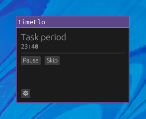

# TimeFlo
Copyright &copy; 2021 Cassaundra Smith

TimeFlo is an implementation of a
[Pomodoro&reg;](https://en.wikipedia.org/wiki/Pomodoro_Technique)-like timer for
breaking out of flow state.



## Status and Roadmap

* [x] Requirements complete.
* [x] Project plan complete.
* [x] Design complete.
* [x] Implementation complete.
* [x] Validation complete.

## Build and Run

Ensure you have the latest Rust toolchain (at least stable). Then, install the
following dependencies according to the [egui
template](https://github.com/emilk/eframe_template/):

On most apt-based Linux distributions:
```
sudo apt-get install libxcb-render0-dev libxcb-shape0-dev libxcb-xfixes0-dev libspeechd-dev libxkbcommon-dev libssl-dev libasound2-dev
```

On Fedora:
```
sudo dnf install clang clang-devel clang-tools-extra speech-dispatcher-devel libxkbcommon-devel pkg-config openssl-devel alsa-lib-devel
```

You should also make sure your Linux desktop follows the XDG specification and
has a running notification daemon, in order for notifications to work as
expected.

To run:
```shell
cargo run --release
```

If the program does not function as expected, please try compiling with
`RUST_LOG=debug` environment variable set, and open an issue with the log
included. If you do not mind using the program with limited functionality, you
can also compile with `--no-default-features`.

## Development Docs

Development documentation is available for TimeFlo, including:

* [Requirements Specification](docs/requirements.md)
* [Project Plan](docs/plan.md)
* [Design Doc](docs/design.md)
* [V&amp;V Report](docs/vnv.md)
